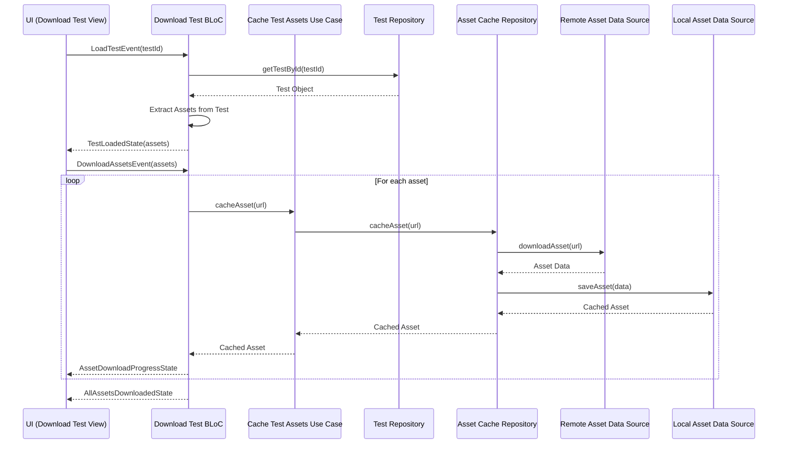

# Design Document: Test Downloading Feature

## Overview

The Test Downloading feature enables students to download and cache all assets associated with a test for offline access. This design document outlines the architecture, components, data models, and implementation strategy for this feature.

The feature will leverage the existing asset caching system in the application, which already provides functionality for downloading and storing individual assets. The new feature will extend this system to handle multiple assets from a test, manage the download queue, and provide a user interface to track download progress.

## Architecture

The feature will follow the Clean Architecture pattern already established in the application, with clear separation between:

1. **Presentation Layer**: UI components and BLoC for state management
2. **Domain Layer**: Use cases, entities, and repository interfaces
3. **Data Layer**: Repository implementations, data sources, and models

### High-Level Flow



## Components and Interfaces

### 1. Presentation Layer

#### 1.1 UI Components

1. **DownloadTestView**: Main screen for the feature
   - Displays the list of assets to download
   - Shows overall download progress
   - Provides controls to start/pause/resume downloads

2. **AssetDownloadCard**: Widget for individual asset in the list
   - Displays asset type icon
   - Shows asset name and source (test/question)
   - Displays download progress or status
   - Provides retry button for failed downloads

#### 1.2 BLoC Components

1. **DownloadTestBloc**: Manages the state of the download process
   - Events:
     - `LoadTestEvent(int testId)`: Loads test and extracts assets
     - `DownloadAssetsEvent(List<AssetToDownload> assets)`: Starts downloading assets
     - `DownloadAssetEvent(AssetToDownload asset)`: Downloads a single asset
     - `RetryDownloadEvent(AssetToDownload asset)`: Retries a failed download
     - `CancelDownloadEvent()`: Cancels all downloads
   - States:
     - `DownloadTestInitial`: Initial state
     - `TestLoadingState`: Loading test data
     - `TestLoadedState(List<AssetToDownload> assets)`: Test loaded with assets
     - `AssetDownloadProgressState(AssetToDownload asset, double progress)`: Asset download in progress
     - `AssetDownloadCompletedState(AssetToDownload asset)`: Asset download completed
     - `AssetDownloadFailedState(AssetToDownload asset, String error)`: Asset download failed
     - `AllAssetsDownloadedState`: All assets downloaded successfully
     - `DownloadErrorState(String message)`: Error in download process

### 2. Domain Layer

#### 2.1 Entities

1. **AssetToDownload**: Entity representing an asset to be downloaded
   - Properties:
     - `String url`: URL of the asset
     - `AssetType type`: Type of asset (video, image, document, etc.)
     - `AssetSource source`: Source of the asset (test, question)
     - `bool isDownloaded`: Whether the asset is already downloaded
     - `String? error`: Error message if download failed

2. **AssetType**: Enum for asset types
   - `video`
   - `image`
   - `pdf`
   - `other`

3. **AssetSource**: Enum for asset sources
   - `test`: Assets from the test itself
   - `question`: Assets from questions
   - `answer`: Assets from answers

#### 2.2 Use Cases

1. **GetTestByIdUseCase**: Retrieves a test by its ID
   - Input: `int testId`
   - Output: `Either<Failure, Test>`

2. **CacheAssetUseCase**: Downloads and caches an asset
   - Input: `String url`
   - Output: `Either<Failure, CachedAsset>`
   - Progress callback: `Function(int received, int total)`

### 3. Data Layer

#### 3.1 Repositories

1. **TestRepository**: Interface for test-related operations
   - Methods:
     - `Future<Either<Failure, Test>> getTestById(int testId)`

2. **AssetCacheRepository**: Interface for asset caching operations (already exists)
   - Methods:
     - `Future<Either<Failure, CachedAsset>> cacheAsset({required String url})`
     - `Future<Either<Failure, File>> retrieveAsset({required String url})`
     - `Future<Either<Failure, bool>> isAssetCached({required String url})`

#### 3.2 Data Sources

1. **RemoteAssetDataSource**: Interface for remote asset operations (already exists)
   - Methods:
     - `Future<Uint8List> downloadAsset(String url, {Function(int received, int total)? onProgress})`
     - `Future<String> getFileType(String url)`
     - `Future<bool> isUrlValid(String url)`

2. **LocalAssetDataSource**: Interface for local asset operations (already exists)
   - Methods:
     - `Future<CachedAssetModel> saveAsset({required String url, required Uint8List data, required String fileType})`
     - `Future<CachedAssetModel?> getCachedAsset(String url)`
     - `Future<bool> isAssetCached(String url)`

## Data Models

### 1. AssetToDownloadModel

```dart
class AssetToDownloadModel extends AssetToDownload {
  final String url;
  final AssetType type;
  final AssetSource source;
  final bool isDownloaded;
  final String? error;
  final double progress;

  const AssetToDownloadModel({
    required this.url,
    required this.type,
    required this.source,
    this.isDownloaded = false,
    this.error,
    this.progress = 0.0,
  });

  factory AssetToDownloadModel.fromJson(Map<String, dynamic> json) {
    return AssetToDownloadModel(
      url: json['url'],
      type: AssetType.values.firstWhere(
        (e) => e.toString() == 'AssetType.${json['type']}',
        orElse: () => AssetType.other,
      ),
      source: AssetSource.values.firstWhere(
        (e) => e.toString() == 'AssetSource.${json['source']}',
        orElse: () => AssetSource.test,
      ),
      isDownloaded: json['isDownloaded'] ?? false,
      error: json['error'],
      progress: json['progress'] ?? 0.0,
    );
  }

  Map<String, dynamic> toJson() {
    return {
      'url': url,
      'type': type.toString().split('.').last,
      'source': source.toString().split('.').last,
      'isDownloaded': isDownloaded,
      'error': error,
      'progress': progress,
    };
  }

  AssetToDownload toEntity() {
    return AssetToDownload(
      url: url,
      type: type,
      source: source,
      isDownloaded: isDownloaded,
      error: error,
    );
  }

  AssetToDownloadModel copyWith({
    String? url,
    AssetType? type,
    AssetSource? source,
    bool? isDownloaded,
    String? error,
    double? progress,
  }) {
    return AssetToDownloadModel(
      url: url ?? this.url,
      type: type ?? this.type,
      source: source ?? this.source,
      isDownloaded: isDownloaded ?? this.isDownloaded,
      error: error ?? this.error,
      progress: progress ?? this.progress,
    );
  }
}
```

## Error Handling

The feature will handle the following error scenarios:

1. **Test Not Found**: When the test ID is invalid or the test doesn't exist
   - Display an error message to the user
   - Provide an option to go back or retry

2. **Asset Download Failure**: When an asset fails to download
   - Display an error message on the asset card
   - Provide a retry button
   - Continue downloading other assets

3. **Network Connectivity Issues**: When the device loses internet connection
   - Pause the download queue
   - Display a message about connectivity issues
   - Automatically resume when connection is restored

4. **Storage Space Issues**: When the device runs out of storage space
   - Pause the download queue
   - Display a message about insufficient storage
   - Provide guidance on freeing up space

## Testing Strategy

### 1. Unit Tests

1. **BLoC Tests**:
   - Test each event and state transition in the DownloadTestBloc
   - Verify correct handling of success and error cases

2. **Use Case Tests**:
   - Test CacheAssetUseCase with different asset types
   - Test asset extraction functionality in the BLoC

3. **Repository Tests**:
   - Test AssetCacheRepository with mock data sources

### 2. Widget Tests

1. **AssetDownloadCard Tests**:
   - Test UI rendering for different asset types
   - Test progress indicator updates
   - Test retry functionality

2. **DownloadTestView Tests**:
   - Test UI rendering with different states
   - Test user interactions (start, pause, resume)

### 3. Integration Tests

1. **End-to-End Download Flow**:
   - Test the complete flow from loading a test to downloading all assets
   - Verify correct caching and retrieval of assets

2. **Error Handling**:
   - Test recovery from network failures
   - Test handling of invalid assets